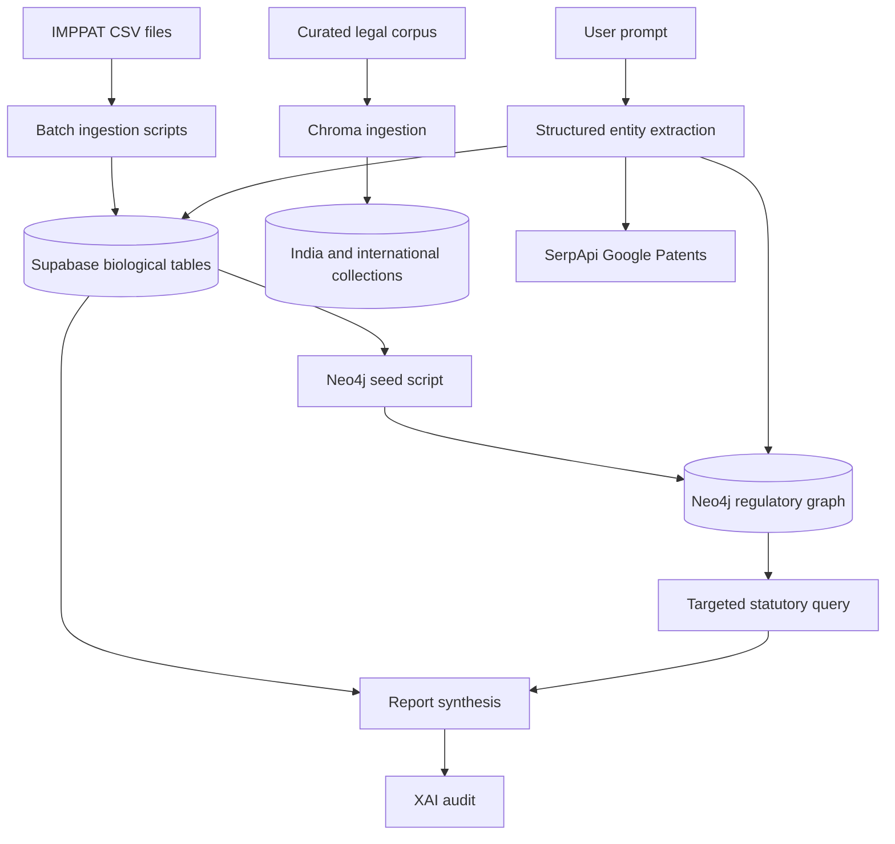

# Data and Integrations

## 1. Data Stores

### Supabase

The backend creates a Supabase client from `SUPABASE_URL` and `SUPABASE_KEY`. The frontend uses `VITE_SUPABASE_URL` and `VITE_SUPABASE_ANON_KEY` for browser authentication and chat persistence.

The repository code references these biological tables:

| Table | Used by | Purpose |
|---|---|---|
| `imppat_phytochemicals` | orchestrator, ingestion scripts, innovation | Master phytochemical identity, SMILES, InChI, InChIKey, synonyms, source page |
| `imppat_admet` | orchestrator, innovation, re-ingestion | Molecular weight, LogP, TPSA, Lipinski, bioavailability, absorption, BBB |
| `imppat_human_targets` | ingestion/health workflows | Compound-to-human-protein associations and STITCH score |
| `imppat_plant_parts` | orchestrator, innovation | Plant, plant part, phytochemical association, literature/source URL |
| `imppat_therapeutics` | orchestrator, innovation, Neo4j seed | Plant, plant part, traditional or therapeutic use |
| `dmr_prohibited_diseases` | DMR evaluation, innovation, health script | Database-backed prohibited disease list |
| `imppat_plants` | innovation route | Plant identity and common/Ayurvedic names; referenced by the innovation route |
| `imppat_formulations` | innovation route | Classical formulation name and reference text |
| `imppat_formulation_plants` | innovation route | Formulation-to-plant relationship |
| `chats` | frontend | User-owned conversation metadata, title, pin state, timestamps |
| `messages` | frontend | User and AI messages, report data, feedback, chat relationship |

The first six tables are explicitly checked by `scripts/verify_database_health.py`. The latter tables are required by application paths but are not all created or migrated in this repository; schema ownership should be maintained in Supabase migrations.

### Neo4j

Neo4j stores the regulatory ontology seeded by `scripts/seed_neo4j_graph.py`:

- `Authority`: CDSCO, NBA, Ministry of Ayush
- `Act`: Drugs and Cosmetics Act, Biological Diversity Act
- `Form`: Form 24D, Form 25D, Form 8, Form 9
- `Plant`: botanical resources loaded from distinct `imppat_therapeutics.plant_name` values

Relationships include `FILED_WITH`, `ISSUED_BY`, `GOVERNS`, `SUBJECT_TO`, `REQUIRES_IP_CLEARANCE`, `CLASSIFIED_AS_TOXIC_UNDER`, and `MANDATES_MANUFACTURING_LICENSE`.

The seed marks plants as Schedule E(1) poisonous when their names match the hard-coded seed set. It then links biological resources to BDA and Form 8, and toxic resources to the Drugs and Cosmetics Act and Form 24D. The orchestrator chooses Form 8 versus Form 9 based on whether the prompt contains `patent` or `ip`.

### Chroma

`core/vector_store.py` creates a persistent Chroma database under `backend/data/chroma_db` and two collections:

- `india_statutes`
- `international_treaties`

Both use the local `all-MiniLM-L6-v2` Sentence Transformers embedding function and cosine distance metadata. `scripts/ingest_legal_corpus.py` upserts curated legal records with IDs, text, statute, section, jurisdiction, and category metadata.

The repository includes persisted Chroma files. Treat them as generated data that must be regenerated from the legal corpus when the source set changes.

## 2. IMPPAT Ingestion

### Full ingestion

`scripts/ingest_all_imppat_supabase.py` searches flexible locations and file-name variants under `backend/data/imppat_raw`. It reads five CSV categories and performs batched upserts of 250 rows. It maintains valid parent phytochemical IDs to protect foreign-key relationships.

### Human targets only

`scripts/ingest_human_targets_only.py` reads `IMPPAT_Human_Target_Proteins.csv`, loads valid parent IDs from Supabase in pages of 1,000, filters invalid foreign keys, and upserts in batches of 500.

### ADMET re-ingestion

`scripts/reingest_admet_only.py` dynamically finds ADMET columns, converts numeric fields safely, validates parent IDs, and upserts in batches of 250.

### Legal corpus

`scripts/ingest_legal_corpus.py` creates or reuses the India and international Chroma collections and upserts the in-code legal record lists with metadata.

## 3. External Services

### Groq

The code uses `ChatGroq` with `openai/gpt-oss-120b` for:

- agentic formulation variable extraction
- DMR structured grading
- LangGraph report synthesis
- fast intent gatekeeping
- XAI auditing
- semantic grounding validation
- optional Sarvam fallback translation

Separate environment variable names are used for different roles, though the code currently points them to the same model family.

### Bhashini

`core/bhashini_client.py` calls the Dhruva inference pipeline at:

`https://dhruva-api.bhashini.gov.in/services/inference/pipeline`

It submits a translation pipeline task with the IndicTrans service ID and supports the 22 language codes represented in the frontend menu. Failures return the source text to protect the main request from a hard translation outage.

### Sarvam

`core/sarvam_client.py` implements chunking, native Sarvam translation for a smaller set of Indian languages, and Groq fallback. The current router path imports and uses Bhashini; Sarvam is an alternate client implementation rather than the active translation path.

### SerpApi

`core/prior_art.py` calls `https://serpapi.com/search` with `engine=google_patents`, an exact-quoted ingredient/claim query, and `SERPAPI_API_KEY`. Only the first three organic results are returned.

## 4. Data Flow and Provenance

## 5. Operational Data Rules

- Keep raw CSV files in `backend/data/imppat_raw` immutable where possible; record source version and ingestion date externally.
- Run full ingestion before Neo4j seeding because the graph seed derives plant names from Supabase.
- Use idempotent upserts and verify parent rows before child data.
- Do not expose Supabase service-role keys to the frontend.
- Configure Supabase Row Level Security so a user can read and mutate only their own chats/messages.
- Version the legal corpus separately from generated Chroma state.
- Add source URLs, effective dates, and jurisdiction metadata to every production legal record.
- Treat Google Patents results as search leads, not authoritative legal conclusions.
