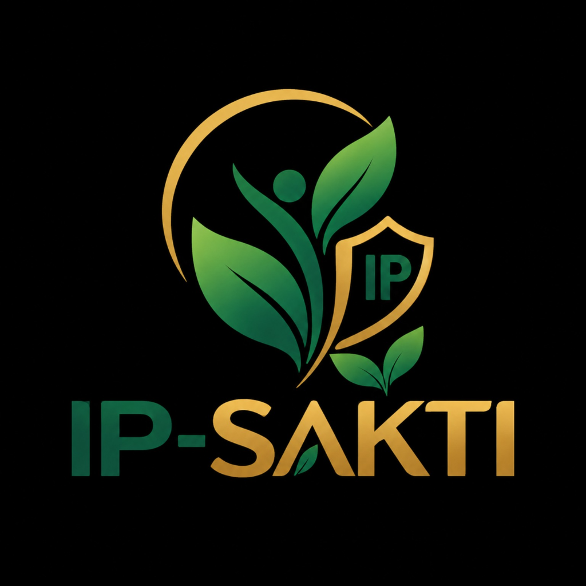

# IP-SAKTI 2.0



**Team:** Init to Win It  
**Event:** Smart India Hackathon 2026  
**Project:** IP-SAKTI 2.0  
**Domain:** Intellectual property, AYUSH regulatory compliance, biological-resource governance, and multilingual statutory guidance

IP-SAKTI 2.0 is an AI-assisted regulatory intelligence platform for Ayurvedic and botanical formulations. It helps a user move from a natural-language formulation idea to a structured India-focused and international compliance dossier. The system combines deterministic statutory rules, structured LLM extraction, a Neo4j regulatory graph, IMPPAT biological data in Supabase, jurisdiction-isolated Chroma retrieval, prior-art search, multilingual translation, explainability metrics, and a React workspace.

> **Important:** This repository is a hackathon prototype and an engineering decision-support system. It does not replace advice from a qualified patent agent, advocate, regulatory consultant, toxicologist, or the relevant government authority. Legal and fee inputs must be verified against current official notifications before real-world filing or commercialization.

## Documentation Map

| Document | Purpose |
|---|---|
| [Technical Architecture](docs/TECHNICAL_ARCHITECTURE.md) | System topology, request flows, LangGraph nodes, trust boundaries, and runtime responsibilities |
| [API and Contracts](docs/API_AND_CONTRACTS.md) | FastAPI routes, payloads, response shapes, authentication, and frontend integration |
| [Features and Differentiation](docs/FEATURES_AND_DIFFERENTIATION.md) | Product capabilities, user journeys, and how IP-SAKTI stands out |
| [Data and Integrations](docs/DATA_AND_INTEGRATIONS.md) | Supabase tables, IMPPAT ingestion, Neo4j ontology, Chroma collections, and external APIs |
| [Operations and Development](docs/OPERATIONS_AND_DEVELOPMENT.md) | Local setup, environment variables, seed/re-ingestion workflows, testing, and deployment notes |
| [Implementation Status](docs/IMPLEMENTATION_STATUS.md) | Verified implementation matrix, known gaps, risks, and recommended next milestones |
| [License](license.md) | Internal-use terms for original project materials and third-party licensing guidance |

## Product at a Glance

The product is designed around five connected phases:

1. **Intake and pre-processing:** typed or voice input enters the React workspace; authenticated users receive a Supabase access token; non-English input is translated through Bhashini before evaluation.
2. **Intent gatekeeping:** a fast Groq structured classifier separates conversational requests from formulation or regulatory evaluation.
3. **Evidence-backed evaluation:** the LangGraph pipeline extracts botanical entities, checks Drugs and Magic Remedies Act triggers, traverses Neo4j, reads IMPPAT biological data from Supabase, retrieves statutory context, and synthesizes national and international dossiers.
4. **Prior art and auditing:** Google Patents results can be retrieved through SerpApi and injected as a warning; a second structured LLM call produces groundedness, completeness, confidence, and source metrics.
5. **Delivery:** reports are optionally translated back to the user language, rendered in the Regulatory Canvas, read aloud, copied, printed to PDF, and persisted as a chat record for signed-in users.

## Repository Layout

```text
sih2026/
├── README.md
├── docs/
│   ├── API_AND_CONTRACTS.md
│   ├── DATA_AND_INTEGRATIONS.md
│   ├── FEATURES_AND_DIFFERENTIATION.md
│   ├── IMPLEMENTATION_STATUS.md
│   ├── OPERATIONS_AND_DEVELOPMENT.md
│   └── TECHNICAL_ARCHITECTURE.md
├── backend/
│   ├── main.py
│   ├── schemas.py
│   ├── requirements.txt
│   ├── core/              # orchestration, retrieval, validation, integrations
│   ├── routers/           # FastAPI HTTP boundary
│   ├── scripts/           # ingestion, seeding, smoke and health utilities
│   └── data/              # raw IMPPAT files and persisted Chroma data
└── frontend/
    ├── package.json
    ├── public/            # logo.png and favicon.png
    └── src/               # React app, workspace components, auth, Supabase client
```

## Quick Start

### Prerequisites

- Python 3.10+ recommended
- Node.js 18+ recommended
- A Supabase project with Auth, chat tables, and the biological tables described in [Data and Integrations](docs/DATA_AND_INTEGRATIONS.md)
- Neo4j database reachable from the backend
- Groq API key for structured extraction and synthesis
- Bhashini credentials for regional-language translation
- SerpApi key for live Google Patents lookup

### Backend

```powershell
cd backend
python -m venv .venv
.\.venv\Scripts\Activate.ps1
pip install -r requirements.txt
python -m uvicorn main:app --reload --host 0.0.0.0 --port 8000
```

Health check: `http://127.0.0.1:8000/health`  
OpenAPI UI: `http://127.0.0.1:8000/docs`

### Frontend

```powershell
cd frontend
npm install
npm run dev
```

The Vite development server normally runs at `http://localhost:5173`.

The current frontend uses a local API base URL in `EvaluatorView.jsx` and `ABSCalculator.jsx` (`http://127.0.0.1:8000`). Change that configuration before deploying the frontend to another environment.

## Configuration Summary

Create `backend/.env` for server-side secrets and `frontend/.env` for Vite-exposed public Supabase settings. Never commit either file.

Backend keys include `SUPABASE_URL`, `SUPABASE_KEY`, `NEO4J_URI`, `NEO4J_USER`, `NEO4J_PASSWORD`, optional `NEO4J_DATABASE`, `GROQ_API_KEY`, `GROQ_API_KEY_2`, `GROQ_API_KEY_3`, `GROQ_API_KEY_4`, `GROQ_API_KEY_5`, `BHASHINI_UDYAT_KEY`, `BHASHINI_INFERENCE_KEY`, `SARVAM_API_KEY`, and `SERPAPI_API_KEY`. Their ownership is documented in [Operations and Development](docs/OPERATIONS_AND_DEVELOPMENT.md).

Frontend keys are `VITE_SUPABASE_URL` and `VITE_SUPABASE_ANON_KEY`.

## Core Safety Model

- Pydantic models constrain entity extraction, DMR evaluation, API input, and response shapes.
- DMR evaluation uses a Supabase disease list plus explicit synonym mappings for several high-risk claims.
- Neo4j and Supabase provide structured evidence before report synthesis.
- Chroma uses separate India and international collections.
- Citation validation and semantic grading can abstain when generated legal output is not adequately grounded.
- DPDP masking removes quantities such as percentages, weights, and volumes before selected LLM/RAG calls, then restores them in the response.
- All reports should be treated as advisory output requiring human review.

## Verification Commands

```powershell
# Frontend static checks
cd frontend
npm run lint
npm run build

# Backend syntax check without contacting external services
cd ..\backend
python -m compileall .
```

The repository contains operational scripts for database health checks, IMPPAT ingestion, ADMET re-ingestion, human-target ingestion, legal-corpus indexing, Neo4j seeding, and a LangGraph smoke invocation. See [Operations and Development](docs/OPERATIONS_AND_DEVELOPMENT.md).

## Team and Product Positioning

IP-SAKTI 2.0 is built for the gap between scientific formulation work and the fragmented legal, biological, and commercialization checks that usually follow it. Its distinctive idea is not merely “ask an LLM about regulation”; it is to force a formulation through multiple evidence surfaces and expose the resulting reasoning as a dual-jurisdiction dossier with audit signals.

The detailed differentiation story, feature inventory, target users, and demo narrative are in [Features and Differentiation](docs/FEATURES_AND_DIFFERENTIATION.md).
