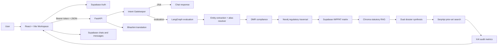
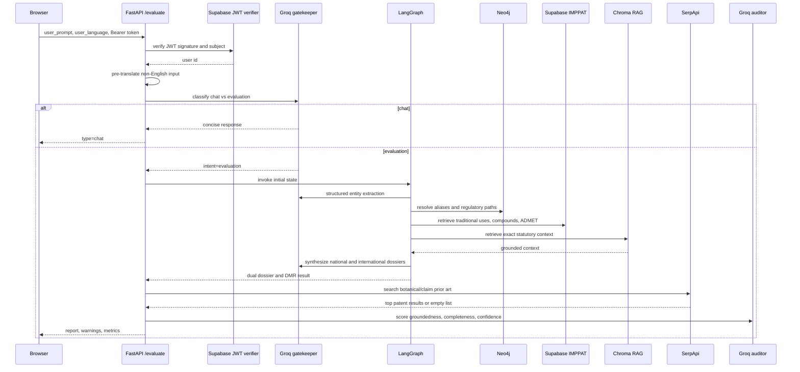
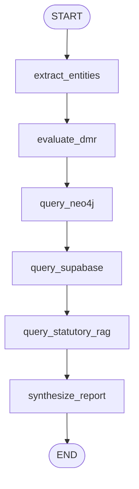

# Technical Architecture

## 1. Architectural Intent

IP-SAKTI 2.0 is a layered web application:

- **Experience layer:** React 19 and Vite provide the workspace, authentication modal, conversation history, voice input, report canvas, read-aloud controls, and ABS calculator UI.
- **API layer:** FastAPI exposes bounded modules for orchestration, classification/RAG, compliance, innovation, and translation.
- **Reasoning layer:** LangGraph coordinates structured extraction, deterministic checks, graph traversal, biological lookup, statutory retrieval, and report synthesis.
- **Evidence layer:** Supabase stores authentication, conversations, IMPPAT-derived relational data, and the DMR prohibited-disease list; Neo4j stores regulatory relationships; Chroma stores jurisdiction-separated legal text.
- **Integration layer:** Groq provides structured language-model operations, Bhashini provides primary translation, Sarvam provides an alternate translation client, and SerpApi provides live Google Patents search.

## 2. Main Runtime Entry Points

`backend/main.py` creates the FastAPI application and registers five routers:

| Prefix | Router | Responsibility |
|---|---|---|
| `/api/v1/ip-core` | `routers/ip_core.py` | Agentic formulation classification and direct dual-jurisdiction RAG |
| `/api/v1/compliance` | `routers/compliance.py` | Deterministic ABS fee calculation |
| `/api/v1/innovation` | `routers/innovation.py` | IMPPAT/classical prior-art and phytochemical evaluation |
| `/api/v1/language` | `routers/language.py` | Bhashini translation endpoint |
| `/api/v1/orchestrate` | `routers/orchestrator.py` | General `/ask` pipeline and authenticated `/evaluate` master pipeline |

`GET /health` returns a basic service status, engine name, jurisdiction isolation state, and the configured citation-rule count.

## 3. End-to-End Evaluation Flow

The frontend's main evaluation call is `POST /api/v1/orchestrate/evaluate`.

### 3.1 Phase A: Intake and language

The frontend accepts typed text and browser speech-to-text. `EvaluatorView.jsx` selects `hi-IN` for Hindi and `en-IN` otherwise for the browser recognition API. The selected language code is sent with the evaluation request. The backend routes non-English input through `BhashiniTranslationClient`, which uses the Dhruva inference pipeline and returns the original text when translation fails.

### 3.2 Phase B: intent gatekeeping

The gatekeeper is a structured Groq call using `IntentClassification`. It routes vague, conversational, coding, mathematics, or trivia requests to `chat`. It routes prompts containing botanical ingredients or specific health claims to `evaluation`. Chat requests do not run the heavy graph pipeline.

### 3.3 Phase C: LangGraph core

The compiled graph in `core/orchestrator.py` is linear:

| Node | Evidence or mutation | Output |
|---|---|---|
| Entity extraction | Groq structured output constrained by `ExtractedEntities`; `EntityResolver` maps vernacular and Ayurvedic aliases to canonical botanical names | `extracted_plants`, `extracted_claims`, `intended_use_type` |
| DMR evaluation | Reads `dmr_prohibited_diseases` from Supabase; sends claims and explicit synonym rules to a structured grader; has a conservative keyword fallback | `dmr_evaluation` |
| Neo4j traversal | Matches canonical `Plant` nodes and filters Form 8/Form 9 by whether the prompt mentions patent/IP | `neo4j_regulatory` |
| Supabase biological query | Reads therapeutic uses, plant-part associations, phytochemicals, and ADMET values | `supabase_biological` |
| Statutory RAG | Converts graph findings into a targeted query and retrieves India-grounded statutory context | `rag_context` |
| Synthesis | Sends a JSON evidence payload to Groq and parses the required national/international delimiters | `final_report` |

The state includes an additional `prior_art_warnings` field and a prior-art graph node helper, but the compiled graph currently performs the live patent lookup in the HTTP `/evaluate` handler after graph completion. That distinction is recorded in the implementation-status document.

### 3.4 Phase D: prior art and audit

`search_existing_patents()` builds an exact-quoted SerpApi Google Patents query from canonical ingredients and the extracted claim. Up to three organic results are converted into title, patent identifier, and snippet records. When results exist, the API prepends a legal warning to both dossiers.

The XAI auditor is another structured Groq call returning:

- `groundedness_score` from 0 to 100
- `completeness`, such as complete or missing toxicity data
- `confidence`, one of high, moderate, or low
- `sources`, assembled from active evidence systems

When auditing fails, the handler uses a deterministic fallback metric set. These metrics are transparency signals, not proof that the dossier is legally correct.

## 4. Direct RAG Architecture

`core/dual_rag_engine.py` is independently exposed through `/api/v1/ip-core/query-dual-rag` and also used by the LangGraph statutory-grounding node.

1. The request is passed through `TradeSecretMasker`.
2. The engine selects the India or international Chroma collection, or both.
3. Four semantic results are retrieved per selected namespace.
4. Groq is prompted to cite legal assertions with `[CIT: ...]` tags.
5. `SemanticValidator` grades support against retrieved context.
6. `CitationValidator` parses supported statute patterns and checks whether the cited statute/section is represented in context.
7. Unsupported or invalid answers can become abstentions.
8. The secret vault is used to restore quantities in non-abstained output.

The two Chroma collections are intentionally separate so Indian law and international treaty context do not silently merge.

## 5. Trust Boundaries and Data Protection

| Boundary | Control | Remaining concern |
|---|---|---|
| Browser to API | JSON requests; `/evaluate` accepts a Supabase bearer token | `/ask`, direct RAG, translation, ABS, and innovation routes are not consistently authenticated |
| User input to model | Quantity masking on selected flows; structured output schemas | The masker only covers quantity patterns, not all trade secrets or identifiers |
| Model to statutory output | Retrieval context, semantic grader, citation validator, abstention | The semantic fallback currently marks output supported when no LLM grader is available |
| Legal corpus | Separate Chroma namespaces and persisted local store | Corpus freshness and official-source provenance require operational governance |
| Database credentials | Environment variables | No secret files should be committed; production secret management is required |
| Browser persistence | Supabase chat/message records, user-scoped queries | Row-level security policies must be configured and tested in Supabase |

## 6. Frontend Architecture

`App.jsx` mounts `AuthProvider`, creates `MainLayout`, loads user chats, and renders `Sidebar`, `EvaluatorView`, and `ABSCalculator`. `EvaluatorView` owns the conversation state, calls `/evaluate`, renders messages, opens a full-height Regulatory Canvas, and supports:

- National versus international dossier selection
- Markdown and GFM rendering
- browser speech-to-text
- browser text-to-speech
- copy and feedback actions
- PDF printing through `react-to-print`
- persistence to Supabase `chats` and `messages`

`AuthContext.jsx` wraps Supabase session initialization, sign-in, sign-up, OTP verification flow support, sign-out, and access-token retrieval. `Sidebar.jsx` contains the 22-language menu and chat management UI.

The visual identity uses the full [IP-SAKTI logo](../frontend/public/logo.png) as the source asset and the compact [favicon](../frontend/public/favicon.png) in the app interface.

## 7. Reliability Characteristics

- External integrations are generally wrapped in exception handling with fallback or empty-result behavior.
- The report pipeline is asynchronous at API boundaries and in LangGraph nodes, but some database and patent calls use synchronous clients inside async functions.
- There is no distributed job queue; a request waits for translation, LLM, database, retrieval, and prior-art work to complete.
- Chroma is local and persistent under `backend/data/chroma_db`.
- The current CORS configuration is permissive for local development and must be restricted for deployment.
